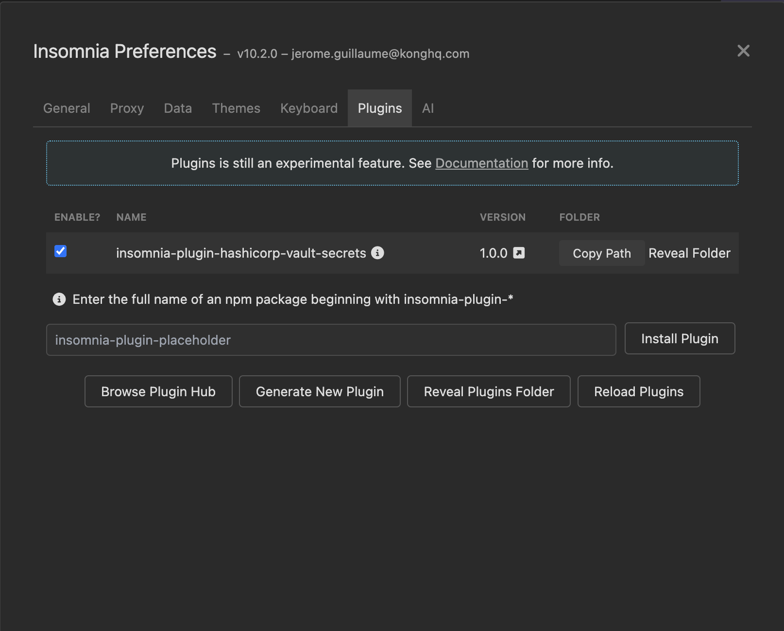
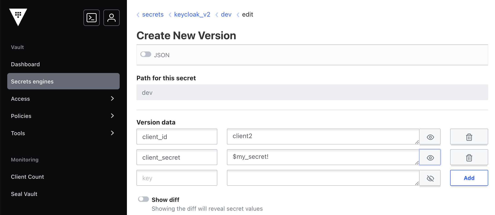
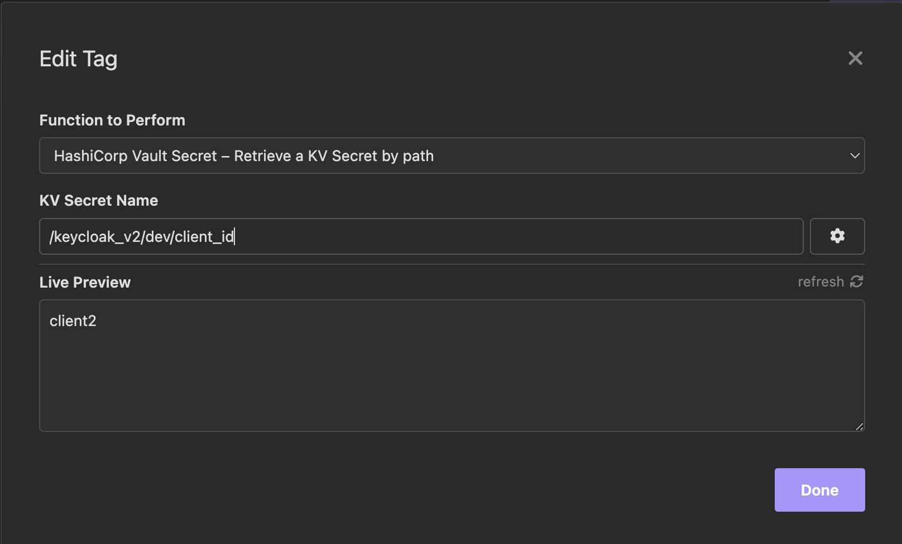
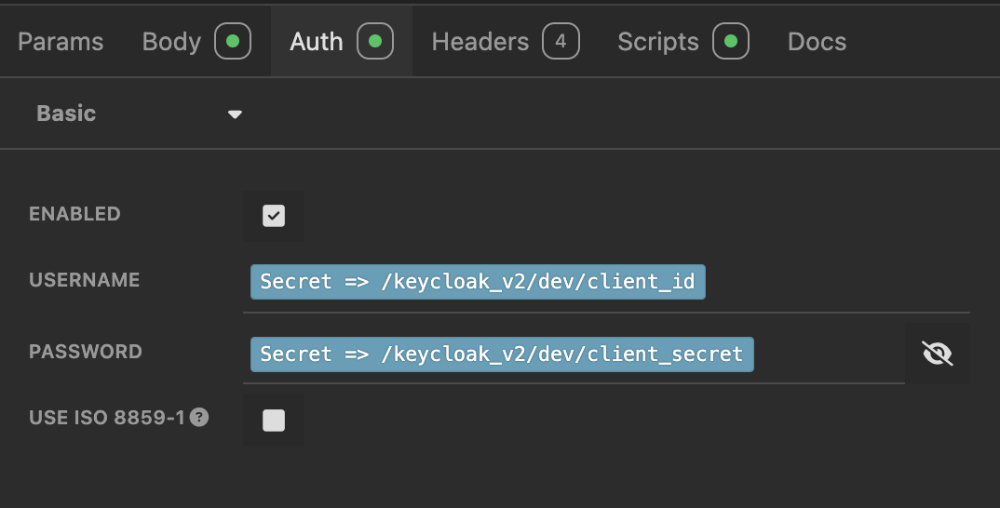

# HashiCorp Vault Secrets for Insomnia plugin


## About
This plugin retrieves the KV secret values from HashiCorp Vault. KV secrets engine v1 and v2 are supported. Once the value has been retrieved from HashiCorp, the plugin puts it in a cache. Please restart Insomnia for refreshing the values.

If you like this plugin, [leave it a ⭐ on Github!](https://github.com/jeromeguillaume/insomnia-plugin-hashicorp-vault-secrets)

## Plugin Installation

### Plugin Hub
You can install it directly from the Insomnia [Plugin Hub](https://insomnia.rest/plugins/insomnia-plugin-hashicorp-vault-secrets)

### Insomnia Preferences
Go to `Application -> Preferences -> Plugins` and enter `insomnia-plugin-hashicorp-vault-secrets` in the `npm package name` field and click on the button `Install Plugin`.

This will download and install the plugin. After installation, you will see the plugin in the list of installed plugins
and the action "HashiCorp Vault Secrets" will be available in the context menu of a folder, no restart required.



## How to Use
Add the following environment variables in Insomnia (see [here](https://docs.insomnia.rest/insomnia/environment-variables#environment-basics)). Adapt the values regarding your HashiCorp environment and select the right release of KV secrets engine ('1' or '2' see [here](https://developer.hashicorp.com/vault/docs/secrets/kv)).
```json
{
  "HASHICORP_URL": "https://hashicorp.client.net",
  "HASHICORP_KV_VERSION": "2",
  "HASHICORP_TOKEN": "** TO_BE_REPLACED **"
}
```
In HashiCorp: create a KV secret (or mount), a secret and a JSON.

For instance: 
- KV secret (or mount): `keycloak_v2`
- secret: `dev`
- JSON:
```json
{
  "client_id": "client2",
  "client_secret": "$my_secret!"
}
```


Press Ctrl + Space in any place where an environment variable is available and pick HashiCorp Vault Secret


Set in KV Secret Name a path to the Vault Secret. The syntax is `/mount/secret/jsonName`
For instance: `/keycloak_v2/dev/client_id`. The `client2` value is retrieved from HashiCorp Vault


Repeat the same action for the client_secret (with `/keycloak_v2/dev/client_secret` path)


## How to Debug
1) Open the Log folders (Insomnia Menu: Help -> Show App Log Folders)
2) Open the file: `renderer.log`
3) See log with `[hashicorp-vault-secrets]`

## Credits
Thanks to [insomnia-plugin-azure-keyvault-secrets](https://insomnia.rest/plugins/insomnia-plugin-azure-keyvault-secrets) built by Gianluigi Conti